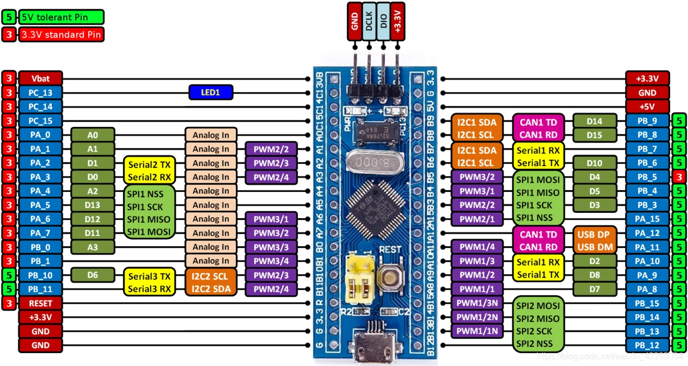

# STM32 Bare-Metal Learning

> A hands-on journey through embedded C programming — from basic language concepts on the host machine to real bare-metal register-level programming on the **STM32F103C8T6 (Blue Pill)**.



---

## 📊 Repo Stats

<table width="100%">
  <tr>
    <td align="center" width="25%">
      
    </td>
    <td align="center" width="25%">
      
    </td>
    <td align="center" width="25%">
      
    </td>
    <td align="center" width="25%">
      
    </td>
  </tr>
</table>

---

## 📋 About This Repository

This repository is a structured learning journal for **bare-metal embedded C** on STM32 microcontrollers.  
It is split into two clear sections:

| Folder | Purpose |
|--------|---------|
| [`host/`](./host/) | Standard C exercises compiled and run on a PC (GCC) |
| [`target/`](./target/) | Bare-metal C projects flashed and run on the STM32F103C8T6 |

The `host/` projects build core C language skills — pointers, structs, unions, bitwise operations, etc.  
The `target/` projects apply those skills directly at the register level on real hardware, with **no HAL or CMSIS** — just raw memory-mapped peripheral access.

---

## 🛠️ Hardware

| Item | Details |
|------|---------|
| **MCU** | STM32F103C8T6 (ARM Cortex-M3, 72 MHz) |
| **Board** | Blue Pill |
| **Flash** | 64 KB |
| **RAM** | 20 KB |
| **Debug** | ST-Link V2 (SWD), ARM Semihosting |
| **IDE** | STM32CubeIDE |

Reference documents are included in the root:
- [`stm32f103c8 (1).pdf`](./stm32f103c8%20(1).pdf) — Datasheet
- [`reference_manual_stm.pdf`](./reference_manual_stm.pdf) — Reference Manual (RM0008)
- [`original-schematic-STM32F103C8T6-Blue_Pill.pdf`](./original-schematic-STM32F103C8T6-Blue_Pill.pdf) — Board Schematic

---

## 📂 Repository Structure

```
STM32/
├── host/                    # C language exercises (runs on PC)
│   ├── pointer/
│   ├── struct/
│   ├── union/
│   ├── bitwise_operator/
│   └── ...                  # 30 projects total
│
├── target/                  # STM32 bare-metal projects
│   ├── helloworld_semihosting/
│   ├── sizeof/
│   ├── 007volatile/
│   ├── led_on/
│   ├── struct_based_led/
│   ├── pin_read/
│   ├── PR/
│   └── KEYPAD/
│
├── stm32-board.png
├── reference_manual_stm.pdf
├── stm32f103c8 (1).pdf
└── original-schematic-STM32F103C8T6-Blue_Pill.pdf
```

---

## ⚙️ How to Build & Flash

### Prerequisites
- [STM32CubeIDE](https://www.st.com/en/development-tools/stm32cubeide.html)
- ST-Link V2 programmer

### Steps
1. Open STM32CubeIDE
2. **File → Open Projects from File System** → select the desired `target/` subfolder
3. Build: `Project → Build Project` (or `Ctrl+B`)
4. Flash: `Run → Debug` with ST-Link connected via SWD

### Semihosting Output (printf)
Projects like `helloworld_semihosting`, `sizeof`, and `KEYPAD` use **ARM Semihosting** to print to the IDE console.  
Make sure the debug configuration has semihosting enabled.

### Host Projects
Host projects are standalone `.c` files. Compile with GCC:
```bash
gcc project.c -o project && ./project
```

---

## 📚 Topics Covered

### C Language Fundamentals (`host/`)
- Data types, type qualifiers, `sizeof`, `typedef`
- Arrays, strings, string literals
- Pointers, pointer arithmetic, struct pointers
- Structs, unions, bitfields, packet structures
- Control flow: `if`, `switch`, loops (`for`, `while`, `do-while`)
- Operators: arithmetic, bitwise, shift
- Functions, macros, ASCII
- Build process understanding

### STM32 Bare-Metal (`target/`)
- Semihosting and `printf` over SWD
- `sizeof` on ARM Cortex-M types
- `volatile` keyword in embedded context
- GPIO configuration via raw register access (RCC, CRH, CRL, ODR, IDR)
- LED blink (pointer-based and struct-based)
- Digital input reading (button → LED)
- 4×4 Matrix Keypad scanning via row/column multiplexing

---

## 📈 Commit Activity

<table width="100%">
  <tr>
    <td align="center" width="50%">
      
    </td>
    <td align="center" width="50%">
      
    </td>
  </tr>
</table>

---

## 📄 License

This project is for educational purposes. All STM32 peripheral code follows patterns from the official [STM32F103 Reference Manual (RM0008)](./reference_manual_stm.pdf).
